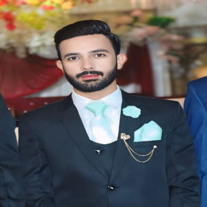

# Hi, I'm Irtaza Hassan

🎓 Computer Science Graduate | 💻 **Unity Game Developer**

##  Contact

📧 **Email:** [irtazahassan460@gmail.com](mailto:irtazahassan460@gmail.com)

💼 **LinkedIn:** [linkedin.com/in/irtaza-hassan-236b40251](https://linkedin.com/in/irtaza-hassan-236b40251)

🎮 **Unity Learn:** [learn.unity.com/u/650f5556edbc2a42ab45ffd0](https://learn.unity.com/u/650f5556edbc2a42ab45ffd0)

##  About Me

I’m a Unity Game Developer passionate about creating immersive and engaging game experiences. 

###  Education

**BSCS** – University of Sahiwal

### Tech Stack

* **Languages:**
  C#
* **Tools:**
  Unity, GitHub
* **Interests:**
  Game Development

### Skills

* Unity
* C#

###  Certifications

* **Unity Essentials**
  🎓 Source: Unity Learn
  
  🔗 [View Certificate](https://www.credly.com/badges/3a469635-b457-4eb8-9ee4-fe522a91b6e1/public_url)

* **Unity Junior Programmer**
  🎓 Source: Unity Learn
  
  🔗 [View Certificate](https://www.credly.com/badges/2c368984-ce37-428d-849f-cd3c04336006/public_url)

* **Success Mindset**
  🎓 Source: HP Life
  
  🔗 [View Certificate](https://www.life-global.org/certificate/4ccb21b6-72eb-41b8-bd45-2ebc9c4932aa)

---

> "Keep learning. Keep building."

---

